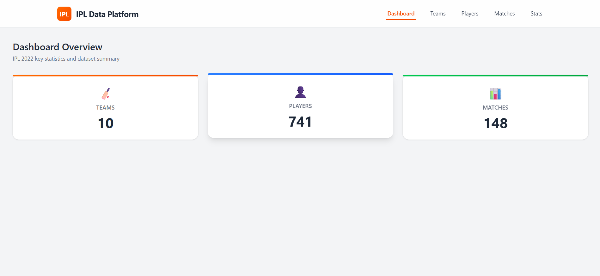
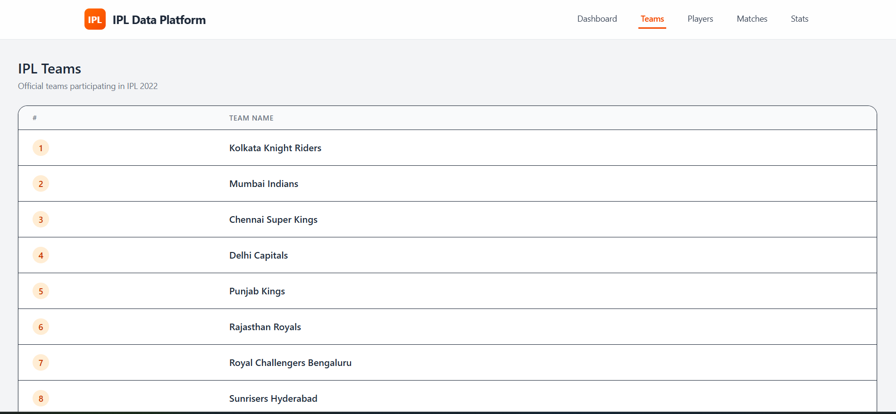
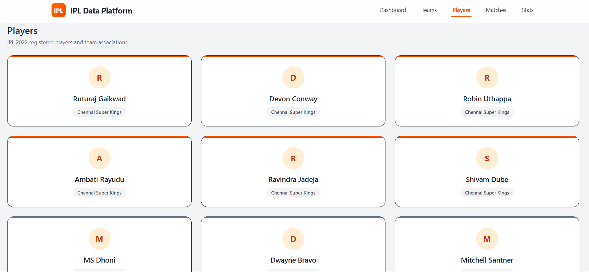
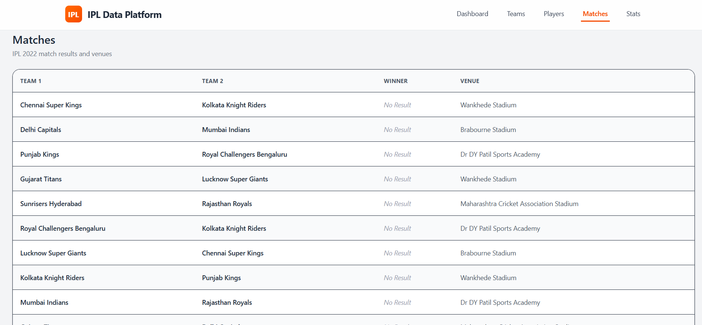
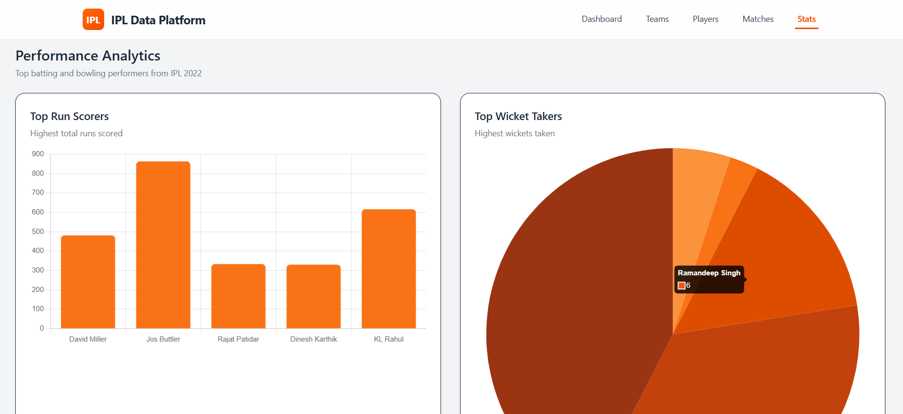

# 🏏 IPL Data Platform – IPL 2022 Analytics Dashboard

A **full-stack IPL 2022 data analytics platform** built with **Node.js, Prisma, PostgreSQL, React, Tailwind CSS, and Chart.js**.  
This project ingests raw IPL JSON data, stores it in a relational database, exposes REST APIs, and visualizes insights through a modern dashboard.

---

## ✨ Project Highlights

- 📦 End-to-end data pipeline (JSON → Database → API → UI)
- ⚙️ Backend built with **Node.js + Express + Prisma ORM**
- 🗄️ Structured relational database using **PostgreSQL**
- 📊 Interactive charts using **Chart.js**
- 🎨 Modern UI with **React + Tailwind CSS**
- 📘 API documentation with **Swagger / OpenAPI**
- 🚀 Scalable and clean project architecture

---

## 🧠 What Is This Project?

The **IPL Data Platform** provides analytics and structured access to **Indian Premier League 2022** data, including:

- Teams
- Players
- Matches
- Scorecards
- Batting statistics
- Bowling statistics

It is designed to demonstrate:
- Backend data modeling
- Data ingestion and transformation
- REST API design
- Frontend dashboards
- Real-world project structure

---

## 👀 Preview

---

## 🏗️ Tech Stack

### Backend
- **Node.js**
- **Express.js**
- **Prisma ORM**
- **PostgreSQL**
- **Swagger (OpenAPI)**

### Frontend
- **React**
- **Tailwind CSS**
- **Chart.js**
- **Axios**

---

## 🔗 Live Preview

You can view the live preview of the project : [🚀 Live Demo]()

---

## 📄 License

This project is licensed under the [MIT License](LICENSE).